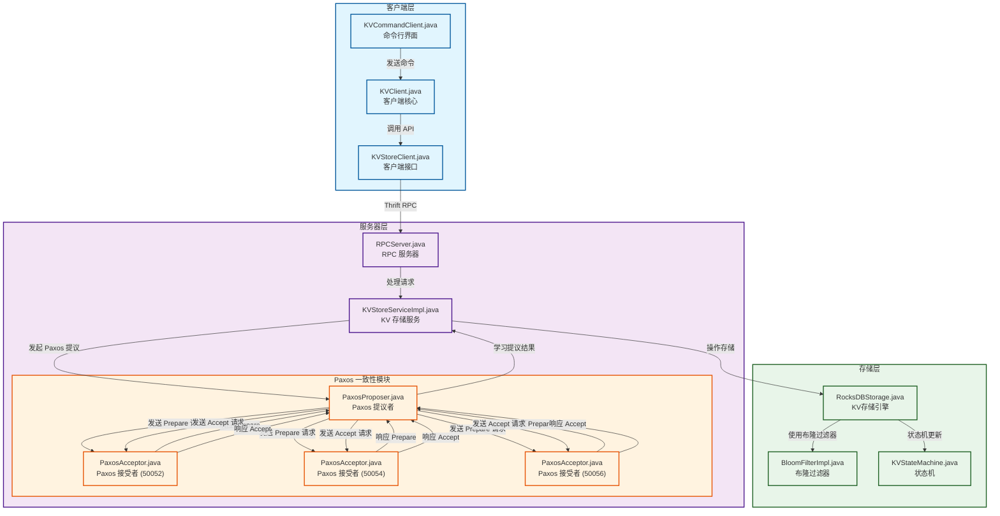

```mermaid
flowchart TB
    %% 定义样式
    classDef clientStyle fill:#e1f5fe,stroke:#01579b,stroke-width:2px
    classDef serverStyle fill:#f3e5f5,stroke:#4a148c,stroke-width:2px
    classDef consensusStyle fill:#fff3e0,stroke:#e65100,stroke-width:2px
    classDef storageStyle fill:#e8f5e9,stroke:#1b5e20,stroke-width:2px
    
    %% 客户端层
    subgraph Client["客户端层"]
        CLI["KVCommandClient.java<br/>命令行界面"]
        KVC["KVClient.java<br/>客户端核心"]
        API["KVStoreClient.java<br/>客户端接口"]
    end
    
    %% 服务器层
    subgraph Server["服务器层"]
        RPC["RPCServer.java<br/>RPC 服务器"]
        
        subgraph PaxosConsensus["Paxos 一致性模块"]
            P1["PaxosAcceptor.java<br/>Paxos 接受者 (50052)"]
            P2["PaxosAcceptor.java<br/>Paxos 接受者 (50054)"]
            P3["PaxosAcceptor.java<br/>Paxos 接受者 (50056)"]
            Proposer["PaxosProposer.java<br/>Paxos 提议者"]
        end
        
        KVService["KVStoreServiceImpl.java<br/>KV 存储服务"]
    end
    
    %% 存储层
    subgraph Storage["存储层"]
        KVS["RocksDBStorage.java<br/>KV存储引擎"]
        BF["BloomFilterImpl.java<br/>布隆过滤器"]
        SM["KVStateMachine.java<br/>状态机"]
    end
    
    %% 连接关系
    CLI -->|"发送命令"| KVC
    KVC -->|"调用 API"| API
    API -->|"Thrift RPC"| RPC
    RPC -->|"处理请求"| KVService
    KVService -->|"发起 Paxos 提议"| Proposer
    Proposer -->|"发送 Prepare 请求"| P1
    Proposer -->|"发送 Prepare 请求"| P2
    Proposer -->|"发送 Prepare 请求"| P3
    P1 -->|"响应 Prepare"| Proposer
    P2 -->|"响应 Prepare"| Proposer
    P3 -->|"响应 Prepare"| Proposer
    Proposer -->|"发送 Accept 请求"| P1
    Proposer -->|"发送 Accept 请求"| P2
    Proposer -->|"发送 Accept 请求"| P3
    P1 -->|"响应 Accept"| Proposer
    P2 -->|"响应 Accept"| Proposer
    P3 -->|"响应 Accept"| Proposer
    Proposer -->|"学习提议结果"| KVService
    KVService -->|"操作存储"| KVS
    KVS -->|"使用布隆过滤器"| BF
    KVS -->|"状态机更新"| SM
    
    %% 应用样式
    class Client,CLI,KVC,API clientStyle
    class Server,RPC,KVService,PaxosConsensus,Proposer,P1,P2,P3 serverStyle
    class PaxosConsensus,Proposer,P1,P2,P3 consensusStyle
    class Storage,KVS,BF,SM storageStyle

```
